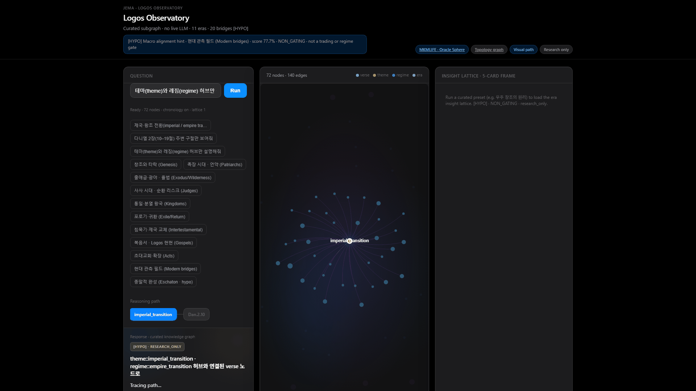

# mkm-universal-root


**Neuro-symbolic integrity kit for developers** — pre-built symbolic grids (lexicon + corpus topology) with optional local SLM paths. **Not** a hosted ingestion SaaS · **not** a GPT-4 replacement · **not** investment or medical advice.

License: **MIT** — see [LICENSE](LICENSE)

## MKM Honesty Engine (public spec)

**Research PoC · fixture bench only · not product SLA**

Methodology distillation (no internal orchestration paths): **[docs/MKM_HONESTY_ENGINE_PUBLIC_SPEC_v1.md](docs/MKM_HONESTY_ENGINE_PUBLIC_SPEC_v1.md)** · **[docs/MKM_FACT_LOCK_CONTROL_CHARTER_PUBLIC_v1.md](docs/MKM_FACT_LOCK_CONTROL_CHARTER_PUBLIC_v1.md)** · **[B2B pilot inquiry (solo OSS)](docs/MKM_B2B_PILOT_INQUIRY_SPEC_PUBLIC_v1.md)**

**Public face (5 lines)**

1. Research PoC only — **not** investment, medical, or trading advice.
2. **Live demos** = read-only observation UI; **offline bench** = reproducible metrics in this repo.
3. Report **B0–B3** separately; never use collapsed OR (**B4**) as one “accuracy” headline.
4. Metrics are on **fixture benches** — **500-pair** OSS smoke plus optional **MKM-UR-Bench-5K** holdout (~947 pairs) — not open-world or full-corpus warranty.
5. `send_gate: HOLD` — third-party smoke repro verified on Discussions #2; no auto-promotion to production.

---

## Quickstart (3 commands)

```bash
git clone https://github.com/mkmlab-v2/mkm-universal-root.git && cd mkm-universal-root
pip install -r requirements.txt
python3 scripts/run_universal_root_oss_cursor_smoke_v1.py   # ~20s · exit 0 · no API keys
```

Windows: use `py` instead of `python3`. Artifact: `reports/universal_root_oss_cursor_smoke_v1_latest.json`

### B2B verify — MKM-UR-Bench-5K holdout (3 commands)

**Solo OSS:** no legal-review gate — **fork, run, post exit 0 on [Discussions #2](https://github.com/mkmlab-v2/mkm-universal-root/discussions/2).**

```bash
pip install -r requirements.txt   # if not done
python3 scripts/run_universal_root_bench_5k_holdout_chain_v1.py
python3 scripts/check_universal_root_bench_5k_v1.py --strict
```

Holdout headline: B0 **12.21%** · B3 **89.20%** · Δ **+76.99pp** (fixture only). Details: **[docs/MKM_B2B_PILOT_INQUIRY_SPEC_PUBLIC_v1.md](docs/MKM_B2B_PILOT_INQUIRY_SPEC_PUBLIC_v1.md)**

---

## Live demo (~30s · no install)

**`[HYPO]` · `[NON_GATING]` · Track C showroom — not this repo's offline smoke · not a product SLA.**

Open in a browser (**no clone**, **no API keys**):

| Step | What | URL |
|------|------|-----|
| 1 | Job spine (primary B2B demo) | https://api.jemaai.cloud/public_showroom_meaning_topology_qa_v2.html?preset=job_job_suffering_reason |
| 2 | Logos Oracle v6 (graph + lattice) | https://api.jemaai.cloud/public_showroom_logos_oracle_v6.html?product=1 |
| 3 | Meaning topology graph | https://api.jemaai.cloud/public_showroom_meaning_topology_graph_v1.html |

Showroom pages are **read-only demos**. Reproducible claims for **this OSS repo** stay on the **offline 500-pair fixture** below — do not treat live UI as a benchmark.

**10s walkthrough (Oracle v6 · fixture-adjacent UI, not a product SLA):**



---

## Repository scope (Y1 public export)

**What you see is what you can reproduce** on the default path: clone → install → ~20s smoke → `exit 0`.

| In this repo | Not in this export |
|--------------|-------------------|
| Offline smoke runner (`scripts/run_universal_root_oss_cursor_smoke_v1.py`) | Hosted APIs, telemetry, or upload/ingestion |
| **500-pair** smoke fixture + optional **MKM-UR-Bench-5K** holdout (`tests/fixtures/nsm_41k_lexicon_crosswalk_5000_v1.json`) | Full monorepo, compression KPI lane (~47.5%), live trading |
| Topology crosswalk + gate scripts (see `docs/final/artifacts/mkm_universal_root_public_export_manifest_v1.json`) | KO shorts, clinical SOAP, auto-training on user docs |
| Dual-plane **raw** metrics; `collapsed_combined_score: null` by design | Single headline “accuracy” or global hallucination claims |
| Corpus **reference counts** (41k lexicon plane · 31,102 verse / 32,082 atom index labels) — not a warranty on open-world performance | Proprietary bulk dumps or unreleased B-track JSONL |

`[HYPO]` · `research_only` · MIT · not production SLA · not investment or medical advice.

---

## What this proves (fixture bench — not production SLA)

**Track B `[HYPO]` · `research_only` · `send_gate: HOLD`**

Metrics below are **raw**, on a **500-pair fixture** (`tests/fixtures/nsm_41k_lexicon_crosswalk_500_v1.json`). Do **not** collapse lexicon and topology into one headline KPI.

| Plane | Metric | Observed (raw) |
|-------|--------|----------------|
| Lexicon 41k | `prime_hit_rate` | **99.53%** |
| Lexicon 41k | `english_only_distortion_rate` | **0.47%** |
| Topology 31k | `verse_reachable_rate` | **99.53%** |
| Walls | divergence exception cards | **2** (`heal`, `learn`) |

### Phase 1A — baseline vs dual-plane (500-pair fixture)

Compare methods on the same fixture (`428` non-control + `72` negative-control pairs). **Do not** publish the collapsed OR row (B4) as a single “accuracy” headline.

| ID | Method | Metric | Raw value |
|----|--------|--------|-----------|
| B0 | English-only naive | `english_only_hit_rate` | **78.04%** |
| B1 | Lexicon plane (41k) | `prime_hit_rate` | **99.53%** |
| B2 | Topology plane (31k) | `verse_reachable_rate` | **99.53%** |
| B3 | Dual-plane aligned (both hit) | `dual_plane_aligned_rate` | **99.53%** |
| B4 | Collapsed OR | `collapsed_or_rate` | 100% — **forbidden headline** |

Wall on B3: `2` lexicon-only-without-topology · `0` topology-only · `0` gap-both.

Reproduce comparison artifact:

```bash
python3 scripts/run_universal_root_baseline_compare_v1.py
# → reports/baseline_vs_dual_plane_v1.json (alias)
# → reports/universal_root_phase1a_baseline_compare_v1_latest.json (canonical)
```

### Named public mini-bench — UR-B0-MISS-HOLDOUT-v1

**94** English-only naive (B0) miss pairs on the same fixture — third-party evaluable holdout (not a global benchmark).

```bash
python3 scripts/build_universal_root_b0_miss_holdout_bench_v1.py
# → tests/fixtures/universal_root_b0_miss_holdout_bench_v1.json
```

### Named scaled bench — MKM-UR-Bench-5K (holdout split)

**947** holdout pairs (from **5000** auto-generated fixture; **80/20** split). Generator **v1.2.0** adds ~**12%** english-surface B0 rows (verified NSM en probes + dual-plane wiring); ~**10%** Strong's-only hard controls preserve wall divergence.

| ID | Method | Metric | Raw value (holdout) |
|----|--------|--------|---------------------|
| B0 | English-only naive | `english_only_hit_rate` | **12.21%** |
| B1 | Lexicon plane (41k) | `prime_hit_rate` | **89.20%** |
| B2 | Topology plane (stub) | `verse_reachable_rate` | **89.20%** |
| B3 | Dual-plane aligned | `dual_plane_aligned_rate` | **89.20%** |

Not a regression of the 500-pair smoke — different probe distribution and scale. Use for **holdout discipline + dual-plane margin (B3−B0 ≈ +77pp)**, not as open-world warranty.

```bash
python3 scripts/check_universal_root_bench_5k_v1.py --strict
# Pre-built artifacts: reports/universal_root_bench_5k_holdout_phase1a_v1_latest.json
```

**Dual-plane integrity:** we report planes separately — `collapsed_combined_score: null` (by design).

**Corpus reference counts** (topology index): **31,102** verse nodes · **32,082** atom nodes — see crosswalk artifact after smoke.

Reproduce command:

```bash
python3 scripts/check_hardcoded_workspace_paths_v1.py --scope oss --strict
python3 scripts/run_universal_root_oss_cursor_smoke_v1.py
```

---

## Concept (past compression craft → today's assembly kit)

| Era | Idea | This repo |
|-----|------|-----------|
| **Heavy ingestion** | Squeeze user corpora into codebooks per job | Symbolic core + gates shipped as reproducible scripts |
| **Universal Root** | Immutable rule/graph layer + optional neural draft | Fixture smoke validates topology crosswalk + wall cards **offline** |

Optional Tier 2 (not required for smoke): local SLM / DeepNSM checkpoint paths — subject to **upstream model licenses** (e.g. Meta Llama community license).

---

## Install (minimal)

```bash
pip install jsonschema pytest
python3 scripts/run_universal_root_oss_cursor_smoke_v1.py
```

---

## Disclaimer

- `[HYPO]` research PoC — no Track A · no live trading · no auto-promotion to production.
- **0.47%** is `english_only_distortion_rate` on the lexicon crosswalk fixture — **not** a universal hallucination or fake-news rate.
- Do not merge these metrics with compression KPIs, MS headlines, or unrelated lanes (e.g. KO shorts timing).

---

## Related work (research lane — not OSS smoke KPI)

Broader **Neuro → Symbolic → Human** architecture context lives in the MKM monorepo (B-track `[HYPO]` · `send_gate: HOLD`):

- **Merged synthesis (SSOT):** `docs/research/NEXT_GEN_HYBRID_AI_MKM_MERGED_LIT_REVIEW_2026-06-20.md` — Hybrid Memory / 4-Vault orchestration **roadmap only** (Y1b); not shipped in this export.
- **Y1b direction:** on-prem orchestration OS — separate from this Y1 fixture smoke; do **not** merge with compression KPIs (~47.5% parallel enterprise lane) or MS headlines (FAIL-COMP-004).

Other monorepo-only benches (e.g. KO shorts STT timing under `scripts/run_ko_shorts_timing_compare_v1.py`) are **not** part of `mkm-universal-root` export smoke.

---

## Export bundle (maintainers)

```bash
python3 scripts/build_mkm_universal_root_public_export_bundle_v1.py --verify-only
python3 scripts/build_mkm_universal_root_public_export_bundle_v1.py --materialize
```

Manifest: `docs/final/artifacts/mkm_universal_root_public_export_manifest_v1.json`

Public push (monorepo): `scripts/Push-GitHub-Explicit.ps1 -Acknowledge` only after gates above exit 0.

---

## Sponsors

GitHub Sponsors slot reserved for Y2+ maintenance — **not required** for Y1. Stars, issues, and **external smoke repro** on [Discussions #2](https://github.com/mkmlab-v2/mkm-universal-root/discussions/2) are the priority signal.

---

## Contributing fixture shards (opt-in · no telemetry)

**Not** auto-training or data upload — optional PRs of **synthetic** probe rows under human review.

See **[CONTRIBUTING.md](CONTRIBUTING.md)** · example: `tests/fixtures/contributions/pending/contributor_example_v1.json`

```bash
python3 scripts/validate_universal_root_contributor_fixture_v1.py \
  --json tests/fixtures/contributions/pending/contributor_example_v1.json
```

---

**Fixture topology stub:** Default clone ships a **fixture-aligned** verse-atom JSONL stub (`tests/fixtures/logos_verse_4d_topology_stub_v1.jsonl`, &lt;1MB) for local reproducibility on the 500-pair bench. The full ~31k-node corpus dump stays in the monorepo private B-track lane; regenerate the stub with `py scripts/extract_fixture_aligned_topology_stub_v1.py` when the fixture or audit changes.
